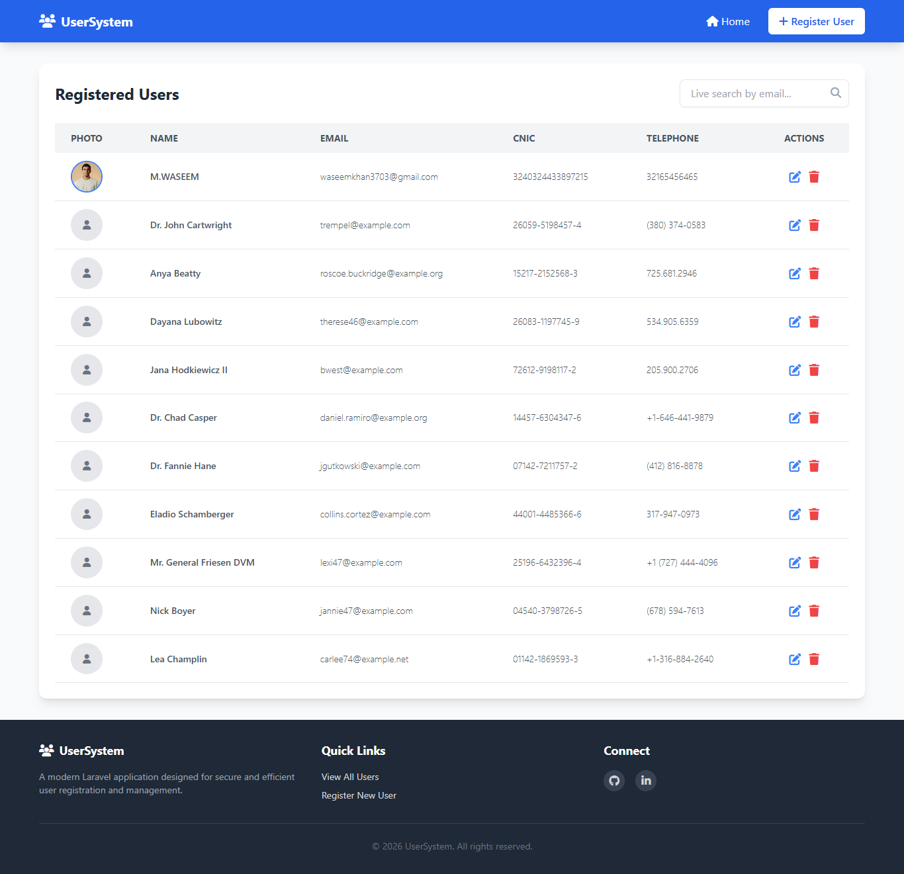
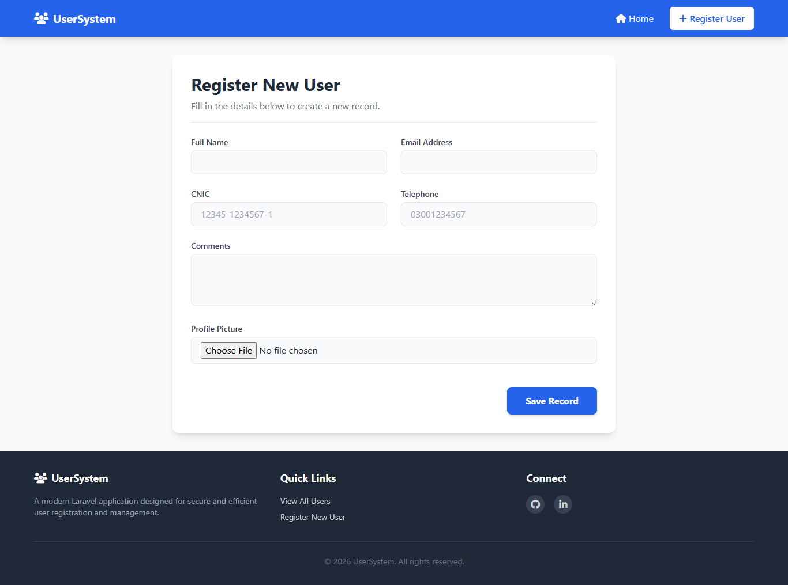
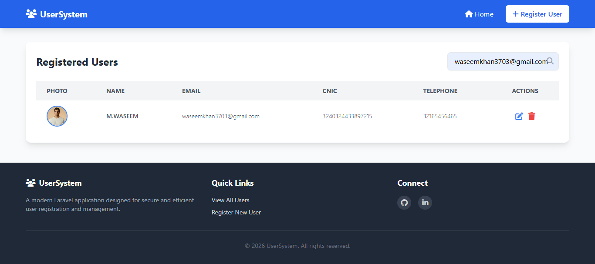
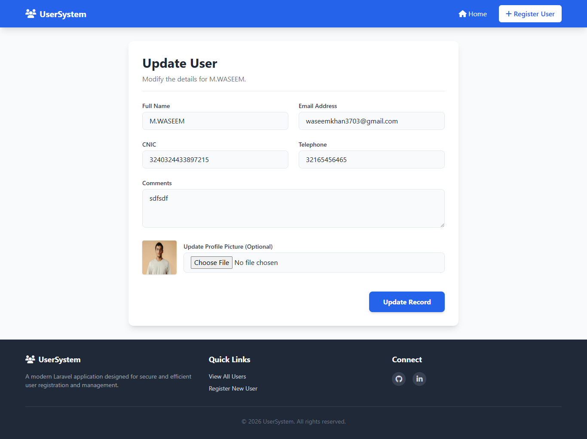
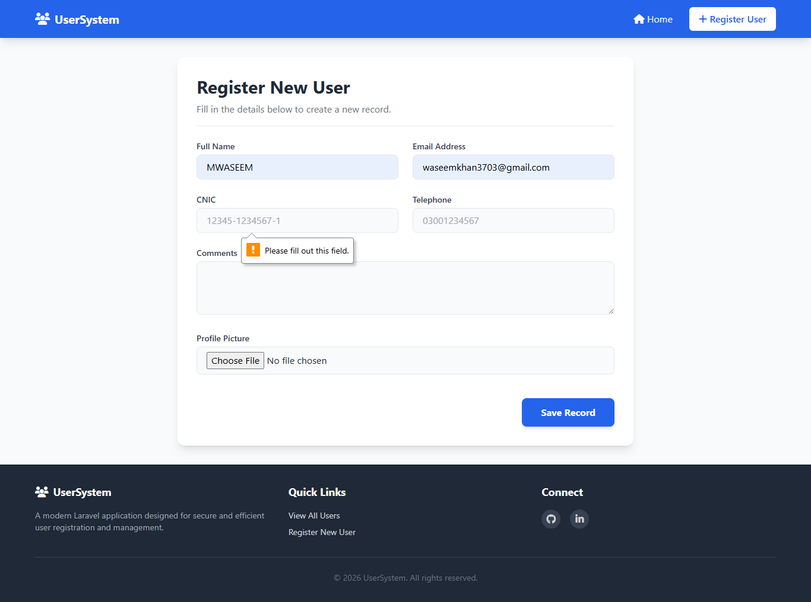

# User Registration Management System

A robust and responsive User Registration System built with Laravel and Tailwind CSS. This application allows administrators to easily manage user data with full CRUD (Create, Read, Update, Delete) capabilities, complete with secure file uploads and live search functionality.

## 🚀 Features

- **Complete CRUD Functionality:** Register, view, edit, and delete user records seamlessly.
- **Live Search:** Instantly filter the user list by email without reloading the page.
- **Image Uploads:** Users can upload profile pictures, which are safely stored and displayed on the dashboard.
- **Strict Data Validation (Frontend & Backend):**
    - **Name:** Restricted to alphabetic characters and spaces only.
    - **Telephone:** Strictly enforced 11-digit numeric limit.
    - **CNIC:** Auto-formatting to standard Pakistani format (`XXXXX-XXXXXXX-X`).
    - **Email:** Unique email validation.
- **Modern UI:** Clean, responsive, and intuitive interface styled using Tailwind CSS and FontAwesome icons.

## 📸 Screenshots

_(Note: Add your actual images to a `docs` or `screenshots` folder in your repository and update these links)_

### Home Page & Live Search

### Registration Form

### Search By Email

### Update Form

### Validation on Registration Form

## 🛠️ Tech Stack

- **Backend:** Laravel (PHP)
- **Database:** MySQL
- **Frontend:** Blade Templates, HTML5, Vanilla JavaScript
- **Styling:** Tailwind CSS (via CDN)
- **Icons:** FontAwesome

## 📋 Prerequisites

Before you begin, ensure you have the following installed on your local machine:

- PHP >= 8.1
- Composer
- MySQL
- A local development server (like XAMPP, Laragon, or Laravel Herd)
